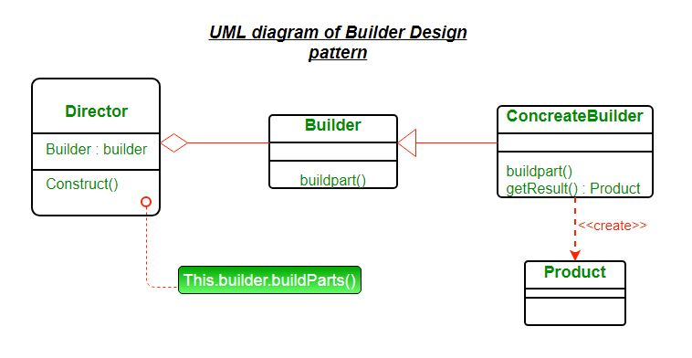

## Builder Design Pattern

Builder pattern aims to `Separate the construction of a complex object from its representation so that the same construction process can create different representations`. It is used to construct a complex object step by step and the final step will return the object. The process of constructing an object should be generic so that it can be used to create different representations of the same object.

<p align="center">

</p>

- **Product** – The product class defines the type of the complex object that is to be generated by the builder pattern.
- **Builder** – This abstract base class defines all of the steps that must be taken in order to correctly create a product. Each step is generally abstract as the actual functionality of the builder is carried out in the concrete subclasses. The GetProduct method is used to return the final product. The builder class is often replaced with a simple interface.
- **ConcreteBuilder** – There may be any number of concrete builder classes inheriting from Builder. These classes contain the functionality to create a particular complex product.
- **Director** – The director-class controls the algorithm that generates the final product object. A director object is instantiated and its Construct method is called. The method includes a parameter to capture the specific concrete builder object that is to be used to generate the product. The director then calls methods of the concrete builder in the correct order to generate the product object. On completion of the process, the GetProduct method of the builder object can be used to return the product.

#### Implement a Builder
- Identify the **parts** of the product and provide methods to create those parts.
- It should proved a method to **assemble** or build the object.
- It must provide a way to get fully built object.
- Optionally builder can keep reference of the product it build so the same can be returned in future
- Director can be a different class or client can act as the director.

#### Let’s see an Example of Builder Design Pattern : 
Consider the construction of a home. Home is the final end product (object) that is to be returned as the output of the construction process. It will have many steps like basement construction, wall construction, and so on roof construction. Finally, the whole home object is returned. Here using the same process you can build houses with different properties.

```java
interface HousePlan 
{ 
	public void setBasement(String basement); 

	public void setStructure(String structure); 

	public void setRoof(String roof); 

	public void setInterior(String interior); 
} 

class House implements HousePlan 
{ 

	private String basement; 
	private String structure; 
	private String roof; 
	private String interior; 

	public void setBasement(String basement) 
	{ 
		this.basement = basement; 
	} 

	public void setStructure(String structure) 
	{ 
		this.structure = structure; 
	} 

	public void setRoof(String roof) 
	{ 
		this.roof = roof; 
	} 

	public void setInterior(String interior) 
	{ 
		this.interior = interior; 
	} 

} 


interface HouseBuilder 
{ 

	public void buildBasement(); 

	public void buildStructure(); 

	public void buildRoof(); 

	public void buildInterior(); 

	public House getHouse(); 
} 

class IglooHouseBuilder implements HouseBuilder 
{ 
	private House house; 

	public IglooHouseBuilder() 
	{ 
		this.house = new House(); 
	} 

	public void buildBasement() 
	{ 
		house.setBasement("Ice Bars"); 
	} 

	public void buildStructure() 
	{ 
		house.setStructure("Ice Blocks"); 
	} 

	public void buildInterior() 
	{ 
		house.setInterior("Ice Carvings"); 
	} 

	public void buildRoof() 
	{ 
		house.setRoof("Ice Dome"); 
	} 

	public House getHouse() 
	{ 
		return this.house; 
	} 
} 

class TipiHouseBuilder implements HouseBuilder 
{ 
	private House house; 

	public TipiHouseBuilder() 
	{ 
		this.house = new House(); 
	} 

	public void buildBasement() 
	{ 
		house.setBasement("Wooden Poles"); 
	} 

	public void buildStructure() 
	{ 
		house.setStructure("Wood and Ice"); 
	} 

	public void buildInterior() 
	{ 
		house.setInterior("Fire Wood"); 
	} 

	public void buildRoof() 
	{ 
		house.setRoof("Wood, caribou and seal skins"); 
	} 

	public House getHouse() 
	{ 
		return this.house; 
	} 

} 

class CivilEngineer 
{ 

	private HouseBuilder houseBuilder; 

	public CivilEngineer(HouseBuilder houseBuilder) 
	{ 
		this.houseBuilder = houseBuilder; 
	} 

	public House getHouse() 
	{ 
		return this.houseBuilder.getHouse(); 
	} 

	public void constructHouse() 
	{ 
		this.houseBuilder.buildBasement(); 
		this.houseBuilder.buildStructure(); 
		this.houseBuilder.buildRoof(); 
		this.houseBuilder.buildInterior(); 
	} 
} 

class Builder 
{ 
	public static void main(String[] args) 
	{ 
		HouseBuilder iglooBuilder = new IglooHouseBuilder(); 
		CivilEngineer engineer = new CivilEngineer(iglooBuilder); 

		engineer.constructHouse(); 

		House house = engineer.getHouse(); 

		System.out.println("Builder constructed: "+ house); 
	} 
} 
```

#### Advantages of Builder Design Pattern
- The parameters to the constructor are reduced and are provided in highly readable method calls.
- 
