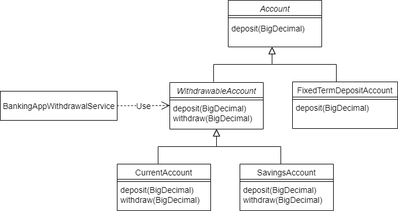
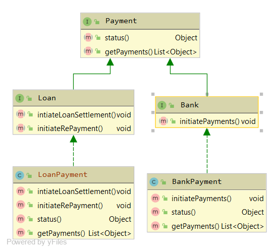

# Solid Principles

- [Single Responsibility Principle](#single-responsibility-principle)
- [Open Closed Principle](#open-closed-principle)
- [Liskov Substitution Principle](#liskov-substitution-principle)
- [Interface Segregation Principle]()
- Dependency Inversion Principle

## Single Responsibility Principle

There should never be more than one reason for a class to change `(each class should have one responsibility, one single purpose)`.

Let’s consider a class that contains code that changes the text in some way. The only job of this class should be **manipulating text**.

```java
public class TextManipulator {
    private String text;

    public TextManipulator(String text) {
        this.text = text;
    }

    public String getText() {
        return text;
    }

    public void appendText(String newText) {
        text = text.concat(newText);
    }

    public void printText() {
        System.out.println(textManipulator.getText());
    }
}
```
Although this may seem fine, it is not a good example of the SRP. Here we have **two responsibilities manipulating and printing the text**.

Having a method that prints out text in this class violate the Single Responsibility Principle. For this purpose, we should create another class, which will only handle printing text.

```java
public class TextPrinter {
    TextManipulator textManipulator;

    public TextPrinter(TextManipulator textManipulator) {
        this.textManipulator = textManipulator;
    }

    public void printText() {
        System.out.println(textManipulator.getText());
    }
}
```

## Open Closed Principle
Software entities should be open for extension, but closed for modification.As a result, when the business requirements change then the entity can be extended, but not modified.

Let’s consider we’re building a calculator app that might have several operations, such as addition and subtraction.

#### we’ll define a top-level interface – CalculatorOperation:

```java
public interface CalculatorOperation {}
```

#### Let’s define an Addition class
```java
public class Addition implements CalculatorOperation {
    private double left;
    private double right;
    private double result = 0.0;

    public Addition(double left, double right) {
        this.left = left;
        this.right = right;
    }

    // getters and setters
}
```
#### Let’s define a Subtraction class

```java
public class Subtraction implements CalculatorOperation {
    private double left;
    private double right;
    private double result = 0.0;

    public Subtraction(double left, double right) {
        this.left = left;
        this.right = right;
    }

    // getters and setters
}
```
#### Let’s now define our main class, which will perform our calculator operations: 

```java
public class Calculator {

    public void calculate(CalculatorOperation operation) {
        if (operation == null) {
            throw new InvalidParameterException("Can not perform operation");
        }

        if (operation instanceof Addition) {
            Addition addition = (Addition) operation;
            addition.setResult(addition.getLeft() + addition.getRight());
        } else if (operation instanceof Subtraction) {
            Subtraction subtraction = (Subtraction) operation;
            subtraction.setResult(subtraction.getLeft() - subtraction.getRight());
        }
    }
}
```
**Although this may seem fine, it’s not a good example of the OCP.** When a new requirement of adding multiplication or divide functionality comes in, we’ve no way besides changing the calculate method of the Calculator class.
To overcome this we need to extract this code and put it in an abstraction layer.

```java
public interface CalculatorOperation {
    void perform();
}
```

```java
public class Addition implements CalculatorOperation {
    private double left;
    private double right;
    private double result;

    // constructor, getters and setters

    @Override
    public void perform() {
        result = left + right;
    }
}
```

```java
public class Division implements CalculatorOperation {
    private double left;
    private double right;
    private double result;

    // constructor, getters and setters
    @Override
    public void perform() {
        if (right != 0) {
            result = left / right;
        }
    }
}
```

```java
public class Calculator {

    public void calculate(CalculatorOperation operation) {
        if (operation == null) {
            throw new InvalidParameterException("Cannot perform operation");
        }
        operation.perform();
    }
}
```

That way the class is closed for modification but open for an extension.

## Liskov Substitution Principle
Objects of a superclass should be replaceable with objects of its subclasses without breaking the application **(If superclass specifies some behaviour, subclass should not change that behaviour)**.

Let’s look at a Banking Application example which supports two account types – `current` and `saving`. These are represented by the classes **CurrentAccount** and **SavingsAccount** respectively.

```java
public abstract class Account {
    protected abstract void deposit(BigDecimal amount);

    /**
     * Reduces the balance of the account by the specified amount
     * provided given amount > 0 and account meets minimum available
     * balance criteria.
     *
     * @param amount
     */
    protected abstract void withdraw(BigDecimal amount);
}
```

```java
public class BankingAppWithdrawalService {
    private Account account;

    public BankingAppWithdrawalService(Account account) {
        this.account = account;
    }

    public void withdraw(BigDecimal amount) {
        account.withdraw(amount);
    }
}
```

The bank now wants to offer a high interest-earning fixed-term deposit account to its customers.
To support this, let’s introduce a new **FixedTermDepositAccount** class. A fixed-term deposit account in the real world “is a” type of account. This implies inheritance in our object-oriented design.
So, let’s make **FixedTermDepositAccount** a subclass of Account:

```java
public class FixedTermDepositAccount extends Account {
    // Overridden methods...
}
```
So far, so good. However, the bank doesn’t want to allow withdrawals for the fixed-term deposit accounts.

This means that the new **FixedTermDepositAccount** class can’t meaningfully provide the withdraw method that Account defines. One common workaround for this is to make **FixedTermDepositAccount** throw an **UnsupportedOperationException** in the method it cannot fulfill.

```java
public class FixedTermDepositAccount extends Account {
    @Override
    protected void deposit(BigDecimal amount) {
        // Deposit into this account
    }

    @Override
    protected void withdraw(BigDecimal amount) {
        throw new UnsupportedOperationException("Withdrawals are not supported by FixedTermDepositAccount!!");
    }
}
```

While the new class works fine, let’s try to use it with the BankingAppWithdrawalService.

```java
Account myFixedTermDepositAccount = new FixedTermDepositAccount();
myFixedTermDepositAccount.deposit(new BigDecimal(1000.00));

BankingAppWithdrawalService withdrawalService = new BankingAppWithdrawalService(myFixedTermDepositAccount);
withdrawalService.withdraw(new BigDecimal(100.00));
```
Unsurprisingly, the banking application crashes with the error:
```output
Withdrawals are not supported by FixedTermDepositAccount!!
```
By not supporting the withdraw method, the **FixedTermDepositAccount** violates this method specification. Therefore, we cannot reliably substitute FixedTermDepositAccount for Account.
In other words, the FixedTermDepositAccount has `violated the Liskov Substitution Principle`.

<p align="center">

</p>

Because all accounts do not support withdrawals, we moved the withdraw method from the Account class to a new abstract subclass **WithdrawableAccount**. Both **CurrentAccount** and **SavingsAccount** allow withdrawals. So they’ve now been made subclasses of the new **WithdrawableAccount**. This new design avoids the issues we saw earlier.

## Interface Segregation Principle
Clients should not be forced to depend upon interfaces that they do not use `(Should not force subclass to implement unwanted methods)`.

#### Sample Interface and Implementation
Let’s look into a situation where we’ve got a Payment interface used by an implementation BankPayment:

```java
public interface Payment { 
    void initiatePayments();
    Object status();
    List<Object> getPayments();
}
```

```java
public class BankPayment implements Payment {

    @Override
    public void initiatePayments() {
       // ...
    }

    @Override
    public Object status() {
        // ...
    }

    @Override
    public List<Object> getPayments() {
        // ...
    }
}
```

So far, the implementing class BankPayment needs all the methods in the Payment interface. Thus, it doesn’t violate the principle.

#### Polluting the Interface
Now, as we move ahead in time, and more features come in, there’s a need to add a **LoanPayment** service. This service is also a kind of Payment but has a few more operations.

```java
public interface Payment {
 
    // original methods
    ...
    void intiateLoanSettlement();
    void initiateRePayment();
}
```
#### Next, we’ll have the LoanPayment implementation:
```java
public class LoanPayment implements Payment {

    @Override
    public void initiatePayments() {
        throw new UnsupportedOperationException("This is not a bank payment");
    }

    @Override
    public Object status() {
        // ...
    }

    @Override
    public List<Object> getPayments() {
        // ...
    }

    @Override
    public void intiateLoanSettlement() {
        // ...
    }

    @Override
    public void initiateRePayment() {
        // ...
    }
}
```
Now, since the Payment interface has changed and more methods were added, all the implementing classes now have to implement the new methods. **The problem is, implementing them is unwanted and could lead to many side effects**. `Here, the LoanPayment implementation class has to implement the initiatePayments() without any actual need for this. And so, the principle is violated.`

#### Applying the Principle
let’s break up the interfaces and apply the Interface Segregation Principle.

<p align="center">

</p>

**As we can see, the interfaces don’t violate the principle**. The implementations don’t have to provide empty methods. This keeps the code clean and reduces the chance of bugs.
